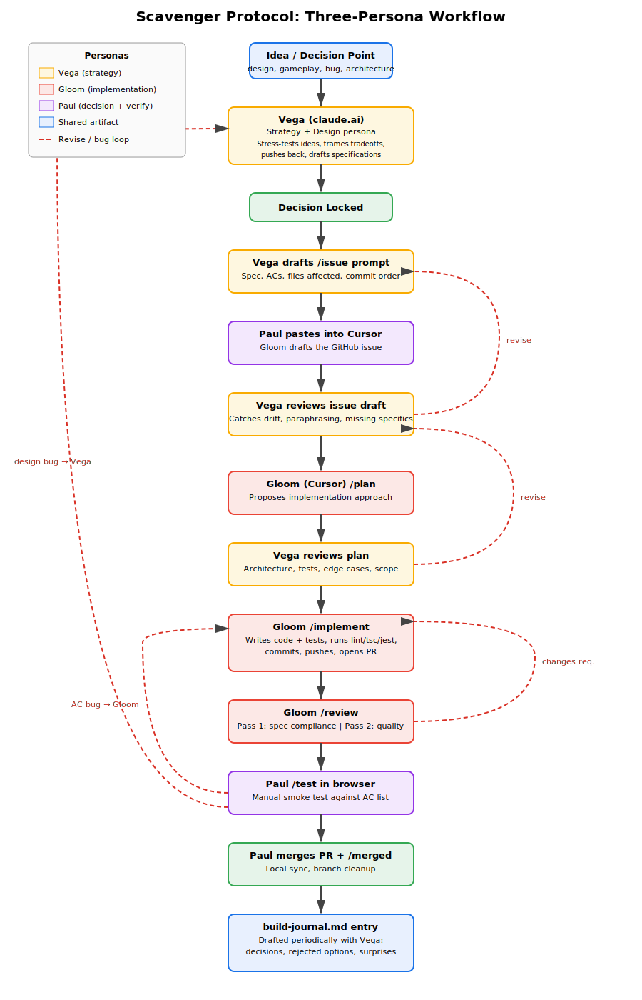

# scavenger-protocol
Retrofuturistic vertical shmup with tether-probe salvage mechanics. Phaser 3 + TypeScript. Portfolio project.

## Deployment

Production deploys are intentional and manually published in the Netlify UI. See [docs/deployment.md](docs/deployment.md) for instructions.

## Summary
Scavenger Protocol is a vertical scrolling shoot-em-up built using a three-persona AI orchestration workflow that I designed to match how engineering leadership actually operates: strategic design, implementation, and review as separate roles with separate tools.
The three personas are Vega, Gloom, and me.
Vega is Claude on claude.ai. Vega is the strategy and design persona. Vega never writes implementation code. Vega's job is to stress-test ideas before they become work: identify risks, frame tradeoffs honestly, push back when an idea is weak, and translate locked decisions into precise specifications. When I have an idea, I bring it to Vega first. Vega challenges it, helps me decide whether to do it, and then writes the issue specification that goes to Gloom.
Gloom is Claude Code running in Cursor. Gloom is the implementation persona. Gloom takes specifications written by Vega and executes them through a structured workflow: /issue drafts the GitHub issue, /plan proposes an implementation plan, /implement writes code and tests, /review does two-pass review (spec compliance, then code quality), and /test runs the dev server for manual verification. Gloom never makes architectural decisions unilaterally. Gloom flags decisions and asks before proceeding when something is genuinely ambiguous.
I sit between them. I make the final calls. I review Vega's specs before sending them to Gloom. I review Gloom's plans and pass them back through Vega when something looks wrong. I do the manual smoke testing, find bugs, and route them appropriately: AC-failures go directly to Gloom; ambiguous behavior or architecture concerns come back to Vega first. I'm the only persona that touches the running code in the browser.
The workflow is structurally three-tier: design with Vega, implement with Gloom, verify myself. Each layer has its own tool, its own context, and its own role boundary. This forces every change to pass through a real review pass at the design level before any code is written, which catches a lot of architectural drift early and cheaply.
Two artifacts capture the work over time. The build journal documents decisions made, options rejected, surprises encountered, and process observations. It is third-person and factual, written periodically with Vega when a session produces enough material to warrant an entry. It is portfolio material, not a personal diary. The code itself, including a CLAUDE.md governance file and a versioned prompt library, captures the operating principles that govern how Vega and Gloom behave on this project.
The discipline matters more than any individual tool. Every change starts with a written decision. Every issue has acceptance criteria written before code is written. Every plan is reviewed before code is written. Every PR passes spec-compliance review and a manual smoke test before merge. Bugs are filed as their own issues rather than worked around. Tests live next to source. The CI pipeline is non-negotiable.
This isn't an AI experiment dressed up as a portfolio piece. This is QA-leadership engineering applied to a roguelite shmup, with AI tools handling the implementation grind so I can focus on architecture, design, and quality control. The game is the artifact. The workflow is the differentiator.

